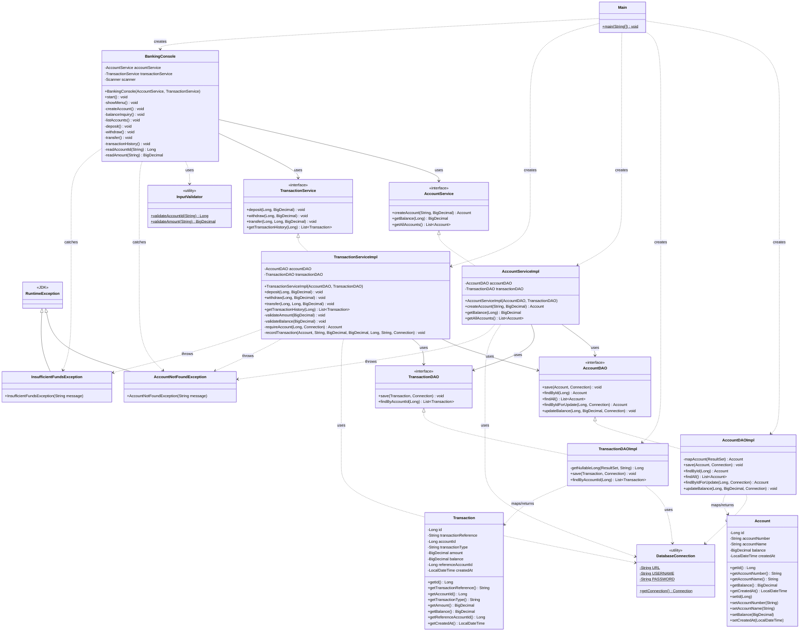

# Class Diagram – BankingSystem

```mermaid
classDiagram
    %% ── MODELS ──────────────────────────────────────────────────────────────
    class Account {
        -Long id
        -String accountNumber
        -String accountName
        -BigDecimal balance
        -LocalDateTime createdAt
        +getId() Long
        +getAccountNumber() String
        +getAccountName() String
        +getBalance() BigDecimal
        +getCreatedAt() LocalDateTime
        +setId(Long)
        +setAccountNumber(String)
        +setAccountName(String)
        +setBalance(BigDecimal)
        +setCreatedAt(LocalDateTime)
    }

    class Transaction {
        -Long id
        -String transactionReference
        -Long accountId
        -String transactionType
        -BigDecimal amount
        -BigDecimal balance
        -Long referenceAccountId
        -LocalDateTime createdAt
        +getId() Long
        +getTransactionReference() String
        +getAccountId() Long
        +getTransactionType() String
        +getAmount() BigDecimal
        +getBalance() BigDecimal
        +getReferenceAccountId() Long
        +getCreatedAt() LocalDateTime
    }

    %% ── EXCEPTIONS ───────────────────────────────────────────────────────────
    class RuntimeException {
        <<JDK>>
    }
    class AccountNotFoundException {
        +AccountNotFoundException(String message)
    }
    class InsufficientFundsException {
        +InsufficientFundsException(String message)
    }
    RuntimeException <|-- AccountNotFoundException
    RuntimeException <|-- InsufficientFundsException

    %% ── UTILITY ──────────────────────────────────────────────────────────────
    class InputValidator {
        <<utility>>
        +validateAccountId(String) Long$
        +validateAmount(String) BigDecimal$
    }

    class DatabaseConnection {
        <<utility>>
        -String URL$
        -String USERNAME$
        -String PASSWORD$
        +getConnection() Connection$
    }

    %% ── DAO INTERFACES ───────────────────────────────────────────────────────
    class AccountDAO {
        <<interface>>
        +save(Account, Connection) void
        +findById(Long) Account
        +findAll() List~Account~
        +findByIdForUpdate(Long, Connection) Account
        +updateBalance(Long, BigDecimal, Connection) void
    }

    class TransactionDAO {
        <<interface>>
        +save(Transaction, Connection) void
        +findByAccountId(Long) List~Transaction~
    }

    %% ── DAO IMPLEMENTATIONS ──────────────────────────────────────────────────
    class AccountDAOImpl {
        -mapAccount(ResultSet) Account
        +save(Account, Connection) void
        +findById(Long) Account
        +findAll() List~Account~
        +findByIdForUpdate(Long, Connection) Account
        +updateBalance(Long, BigDecimal, Connection) void
    }

    class TransactionDAOImpl {
        -getNullableLong(ResultSet, String) Long
        +save(Transaction, Connection) void
        +findByAccountId(Long) List~Transaction~
    }

    AccountDAO <|.. AccountDAOImpl
    TransactionDAO <|.. TransactionDAOImpl
    AccountDAOImpl ..> DatabaseConnection : uses
    TransactionDAOImpl ..> DatabaseConnection : uses
    AccountDAOImpl ..> Account : maps/returns
    TransactionDAOImpl ..> Transaction : maps/returns

    %% ── SERVICE INTERFACES ───────────────────────────────────────────────────
    class AccountService {
        <<interface>>
        +createAccount(String, BigDecimal) Account
        +getBalance(Long) BigDecimal
        +getAllAccounts() List~Account~
    }

    class TransactionService {
        <<interface>>
        +deposit(Long, BigDecimal) void
        +withdraw(Long, BigDecimal) void
        +transfer(Long, Long, BigDecimal) void
        +getTransactionHistory(Long) List~Transaction~
    }

    %% ── SERVICE IMPLEMENTATIONS ──────────────────────────────────────────────
    class AccountServiceImpl {
        -AccountDAO accountDAO
        -TransactionDAO transactionDAO
        +AccountServiceImpl(AccountDAO, TransactionDAO)
        +createAccount(String, BigDecimal) Account
        +getBalance(Long) BigDecimal
        +getAllAccounts() List~Account~
    }

    class TransactionServiceImpl {
        -AccountDAO accountDAO
        -TransactionDAO transactionDAO
        +TransactionServiceImpl(AccountDAO, TransactionDAO)
        +deposit(Long, BigDecimal) void
        +withdraw(Long, BigDecimal) void
        +transfer(Long, Long, BigDecimal) void
        +getTransactionHistory(Long) List~Transaction~
        -validateAmount(BigDecimal) void
        -validateBalance(BigDecimal) void
        -requireAccount(Long, Connection) Account
        -recordTransaction(Account, String, BigDecimal, BigDecimal, Long, String, Connection) void
    }

    AccountService <|.. AccountServiceImpl
    TransactionService <|.. TransactionServiceImpl
    AccountServiceImpl --> AccountDAO : uses
    AccountServiceImpl --> TransactionDAO : uses
    TransactionServiceImpl --> AccountDAO : uses
    TransactionServiceImpl --> TransactionDAO : uses
    AccountServiceImpl ..> DatabaseConnection : uses
    TransactionServiceImpl ..> DatabaseConnection : uses
    AccountServiceImpl ..> AccountNotFoundException : throws
    TransactionServiceImpl ..> AccountNotFoundException : throws
    TransactionServiceImpl ..> InsufficientFundsException : throws

    %% ── UI ───────────────────────────────────────────────────────────────────
    class BankingConsole {
        -AccountService accountService
        -TransactionService transactionService
        -Scanner scanner
        +BankingConsole(AccountService, TransactionService)
        +start() void
        -showMenu() void
        -createAccount() void
        -balanceInquiry() void
        -listAccounts() void
        -deposit() void
        -withdraw() void
        -transfer() void
        -transactionHistory() void
        -readAccountId(String) Long
        -readAmount(String) BigDecimal
    }

    BankingConsole --> AccountService : uses
    BankingConsole --> TransactionService : uses
    BankingConsole ..> InputValidator : uses
    BankingConsole ..> AccountNotFoundException : catches
    BankingConsole ..> InsufficientFundsException : catches

    %% ── ENTRY POINT ──────────────────────────────────────────────────────────
    class Main {
        +main(String[]) void$
    }

    Main ..> AccountDAOImpl : creates
    Main ..> TransactionDAOImpl : creates
    Main ..> AccountServiceImpl : creates
    Main ..> TransactionServiceImpl : creates
    Main ..> BankingConsole : creates
```
