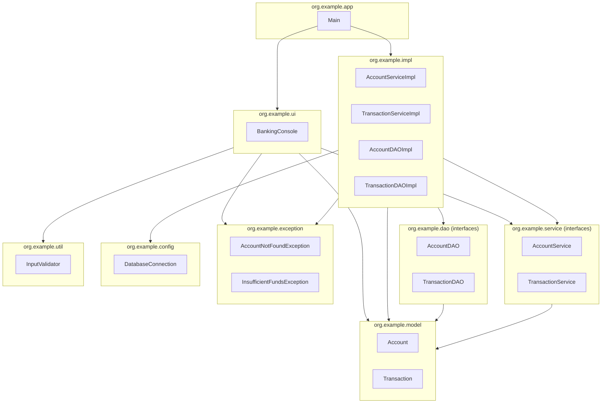

# Package / Component Diagram – BankingSystem

Shows how packages depend on one another.

```mermaid
graph TD
    subgraph app["org.example.app"]
        Main["Main"]
    end

    subgraph ui["org.example.ui"]
        BankingConsole["BankingConsole"]
    end

    subgraph service["org.example.service (interfaces)"]
        AccountService["AccountService"]
        TransactionService["TransactionService"]
    end

    subgraph impl["org.example.impl"]
        AccountServiceImpl["AccountServiceImpl"]
        TransactionServiceImpl["TransactionServiceImpl"]
        AccountDAOImpl["AccountDAOImpl"]
        TransactionDAOImpl["TransactionDAOImpl"]
    end

    subgraph dao["org.example.dao (interfaces)"]
        AccountDAO["AccountDAO"]
        TransactionDAO["TransactionDAO"]
    end

    subgraph model["org.example.model"]
        Account["Account"]
        Transaction["Transaction"]
    end

    subgraph exception["org.example.exception"]
        AccountNotFoundException["AccountNotFoundException"]
        InsufficientFundsException["InsufficientFundsException"]
    end

    subgraph config["org.example.config"]
        DatabaseConnection["DatabaseConnection"]
    end

    subgraph util["org.example.util"]
        InputValidator["InputValidator"]
    end

    Main --> ui
    Main --> impl
    ui --> service
    ui --> model
    ui --> exception
    ui --> util
    impl --> dao
    impl --> model
    impl --> config
    impl --> exception
    impl --> service
    dao --> model
    service --> model
```
