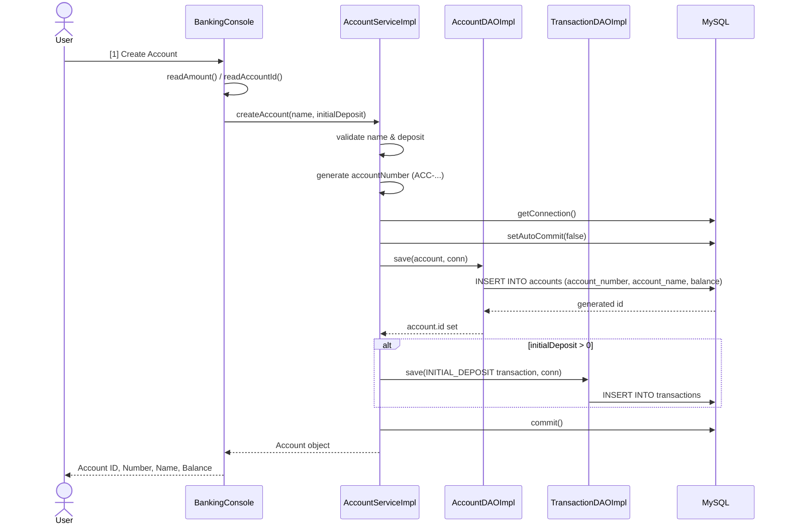
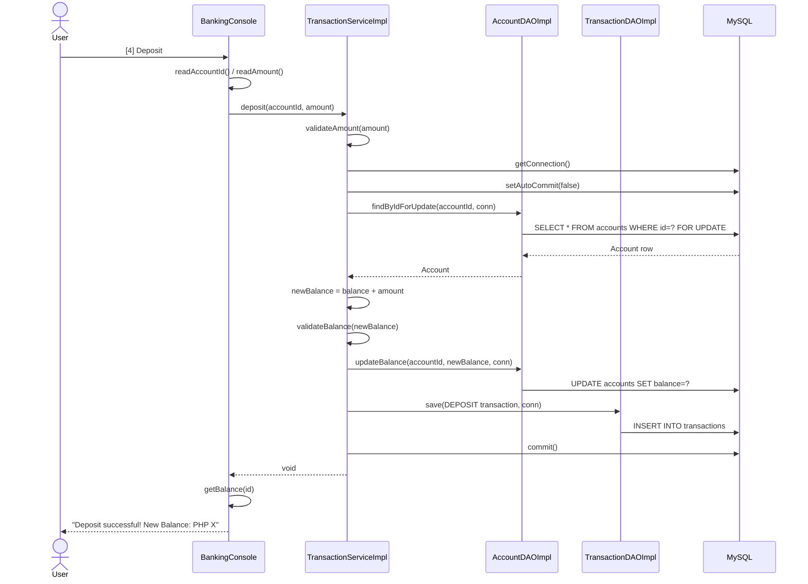
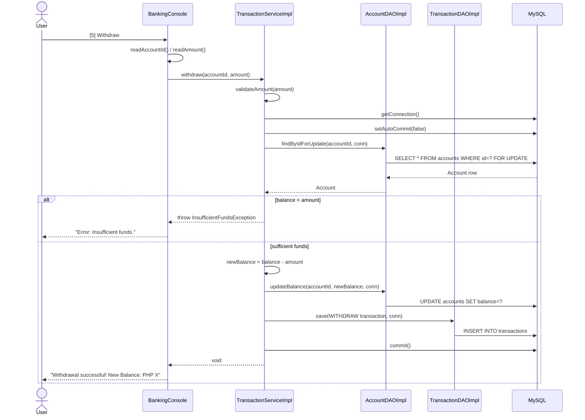
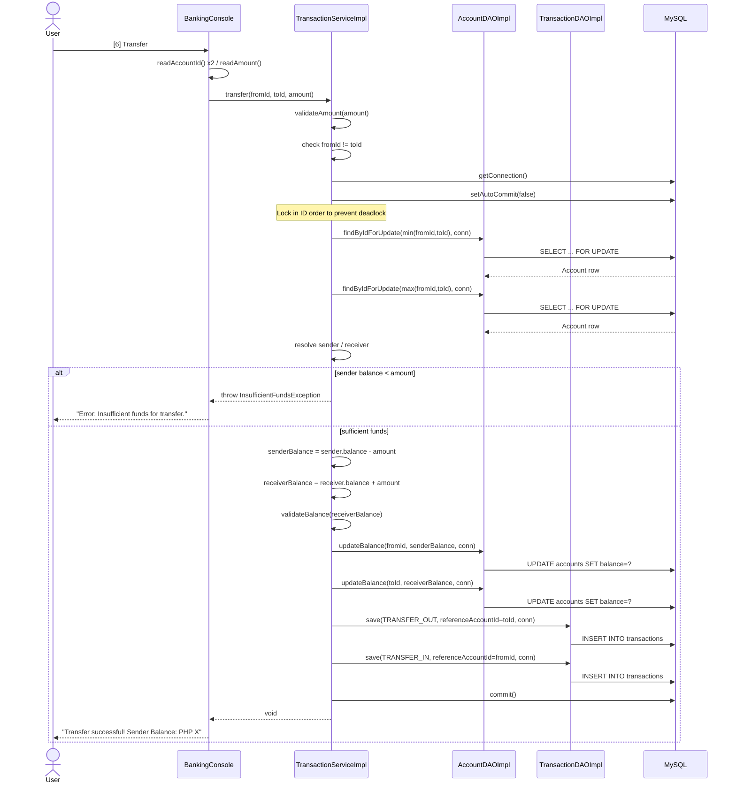
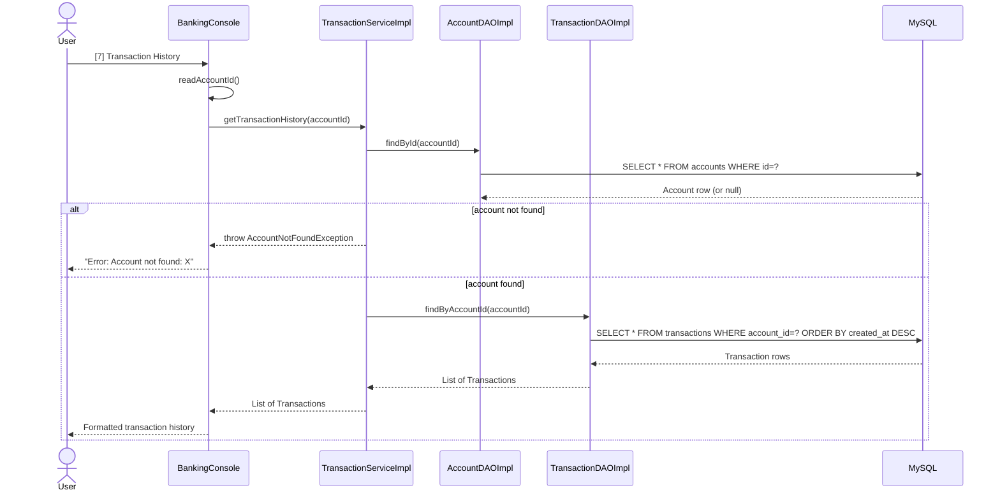

# Sequence Diagrams – BankingSystem

---

## 1. Create Account

```mermaid
sequenceDiagram
    actor User
    participant Console as BankingConsole
    participant AService as AccountServiceImpl
    participant ADAO as AccountDAOImpl
    participant TDAO as TransactionDAOImpl
    participant DB as MySQL

    User->>Console: [1] Create Account
    Console->>Console: readAmount() / readAccountId()
    Console->>AService: createAccount(name, initialDeposit)
    AService->>AService: validate name & deposit
    AService->>AService: generate accountNumber (ACC-...)
    AService->>DB: getConnection()
    AService->>DB: setAutoCommit(false)
    AService->>ADAO: save(account, conn)
    ADAO->>DB: INSERT INTO accounts (account_number, account_name, balance)
    DB-->>ADAO: generated id
    ADAO-->>AService: account.id set
    alt initialDeposit > 0
        AService->>TDAO: save(INITIAL_DEPOSIT transaction, conn)
        TDAO->>DB: INSERT INTO transactions
    end
    AService->>DB: commit()
    AService-->>Console: Account object
    Console-->>User: Account ID, Number, Name, Balance
```

---

## 2. Deposit

```mermaid
sequenceDiagram
    actor User
    participant Console as BankingConsole
    participant TService as TransactionServiceImpl
    participant ADAO as AccountDAOImpl
    participant TDAO as TransactionDAOImpl
    participant DB as MySQL

    User->>Console: [4] Deposit
    Console->>Console: readAccountId() / readAmount()
    Console->>TService: deposit(accountId, amount)
    TService->>TService: validateAmount(amount)
    TService->>DB: getConnection()
    TService->>DB: setAutoCommit(false)
    TService->>ADAO: findByIdForUpdate(accountId, conn)
    ADAO->>DB: SELECT * FROM accounts WHERE id=? FOR UPDATE
    DB-->>ADAO: Account row
    ADAO-->>TService: Account
    TService->>TService: newBalance = balance + amount
    TService->>TService: validateBalance(newBalance)
    TService->>ADAO: updateBalance(accountId, newBalance, conn)
    ADAO->>DB: UPDATE accounts SET balance=?
    TService->>TDAO: save(DEPOSIT transaction, conn)
    TDAO->>DB: INSERT INTO transactions
    TService->>DB: commit()
    TService-->>Console: void
    Console->>Console: getBalance(id)
    Console-->>User: "Deposit successful! New Balance: PHP X"
```

---

## 3. Withdraw

```mermaid
sequenceDiagram
    actor User
    participant Console as BankingConsole
    participant TService as TransactionServiceImpl
    participant ADAO as AccountDAOImpl
    participant TDAO as TransactionDAOImpl
    participant DB as MySQL

    User->>Console: [5] Withdraw
    Console->>Console: readAccountId() / readAmount()
    Console->>TService: withdraw(accountId, amount)
    TService->>TService: validateAmount(amount)
    TService->>DB: getConnection()
    TService->>DB: setAutoCommit(false)
    TService->>ADAO: findByIdForUpdate(accountId, conn)
    ADAO->>DB: SELECT * FROM accounts WHERE id=? FOR UPDATE
    DB-->>ADAO: Account row
    ADAO-->>TService: Account
    alt balance < amount
        TService-->>Console: throw InsufficientFundsException
        Console-->>User: "Error: Insufficient funds."
    else sufficient funds
        TService->>TService: newBalance = balance - amount
        TService->>ADAO: updateBalance(accountId, newBalance, conn)
        ADAO->>DB: UPDATE accounts SET balance=?
        TService->>TDAO: save(WITHDRAW transaction, conn)
        TDAO->>DB: INSERT INTO transactions
        TService->>DB: commit()
        TService-->>Console: void
        Console-->>User: "Withdrawal successful! New Balance: PHP X"
    end
```

---

## 4. Transfer

```mermaid
sequenceDiagram
    actor User
    participant Console as BankingConsole
    participant TService as TransactionServiceImpl
    participant ADAO as AccountDAOImpl
    participant TDAO as TransactionDAOImpl
    participant DB as MySQL

    User->>Console: [6] Transfer
    Console->>Console: readAccountId() x2 / readAmount()
    Console->>TService: transfer(fromId, toId, amount)
    TService->>TService: validateAmount(amount)
    TService->>TService: check fromId != toId
    TService->>DB: getConnection()
    TService->>DB: setAutoCommit(false)
    Note over TService: Lock in ID order to prevent deadlock
    TService->>ADAO: findByIdForUpdate(min(fromId,toId), conn)
    ADAO->>DB: SELECT ... FOR UPDATE
    DB-->>ADAO: Account row
    TService->>ADAO: findByIdForUpdate(max(fromId,toId), conn)
    ADAO->>DB: SELECT ... FOR UPDATE
    DB-->>ADAO: Account row
    TService->>TService: resolve sender / receiver
    alt sender balance < amount
        TService-->>Console: throw InsufficientFundsException
        Console-->>User: "Error: Insufficient funds for transfer."
    else sufficient funds
        TService->>TService: senderBalance = sender.balance - amount
        TService->>TService: receiverBalance = receiver.balance + amount
        TService->>TService: validateBalance(receiverBalance)
        TService->>ADAO: updateBalance(fromId, senderBalance, conn)
        ADAO->>DB: UPDATE accounts SET balance=?
        TService->>ADAO: updateBalance(toId, receiverBalance, conn)
        ADAO->>DB: UPDATE accounts SET balance=?
        TService->>TDAO: save(TRANSFER_OUT, referenceAccountId=toId, conn)
        TDAO->>DB: INSERT INTO transactions
        TService->>TDAO: save(TRANSFER_IN, referenceAccountId=fromId, conn)
        TDAO->>DB: INSERT INTO transactions
        TService->>DB: commit()
        TService-->>Console: void
        Console-->>User: "Transfer successful! Sender Balance: PHP X"
    end
```

---

## 5. Transaction History

```mermaid
sequenceDiagram
    actor User
    participant Console as BankingConsole
    participant TService as TransactionServiceImpl
    participant ADAO as AccountDAOImpl
    participant TDAO as TransactionDAOImpl
    participant DB as MySQL

    User->>Console: [7] Transaction History
    Console->>Console: readAccountId()
    Console->>TService: getTransactionHistory(accountId)
    TService->>ADAO: findById(accountId)
    ADAO->>DB: SELECT * FROM accounts WHERE id=?
    DB-->>ADAO: Account row (or null)
    alt account not found
        TService-->>Console: throw AccountNotFoundException
        Console-->>User: "Error: Account not found: X"
    else account found
        TService->>TDAO: findByAccountId(accountId)
        TDAO->>DB: SELECT * FROM transactions WHERE account_id=? ORDER BY created_at DESC
        DB-->>TDAO: Transaction rows
        TDAO-->>TService: List of Transactions
        TService-->>Console: List of Transactions
        Console-->>User: Formatted transaction history
    end
```
